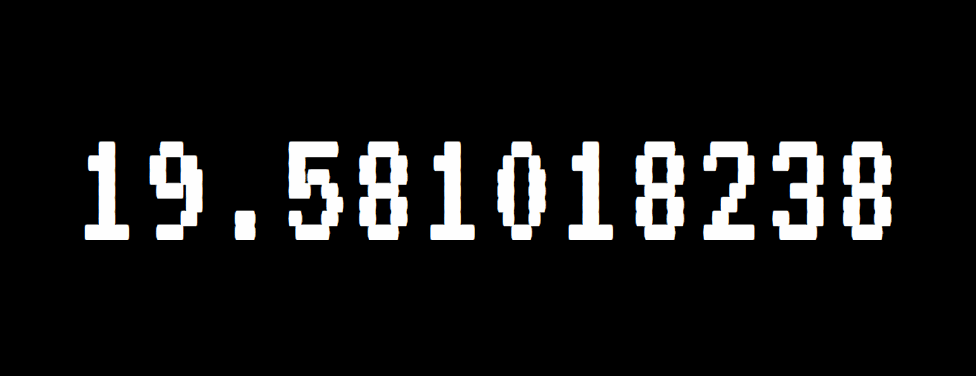

# Motivation

[](https://app.netlify.com/sites/motivation-countdown/deploys)



输入生日，看时间流逝

## Other Editions (其他版本)

- Wallpaper Engine Edition ([Source Code](https://github.com/NeverBehave/Motivation/tree/Wallpaper-Engine)): https://steamcommunity.com/workshop/filedetails/?id=1683433667

- Inspired by Project(Also Macos ScreenSaver): https://github.com/soffes/Motivation

- Windows ScreenSaver: @TODO

## Project setup
```
yarn install
```

### Compiles and hot-reloads for development
```
yarn run serve
```

### Compiles and minifies for production
```
yarn run build
```

### Run your tests
```
yarn run test
```

### Lints and fixes files
```
yarn run lint
```

### Customize configuration
See [Configuration Reference](https://cli.vuejs.org/config/).
